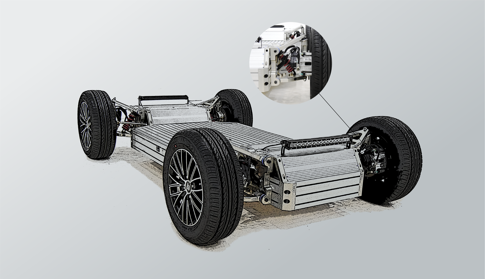
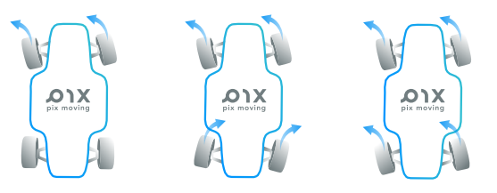
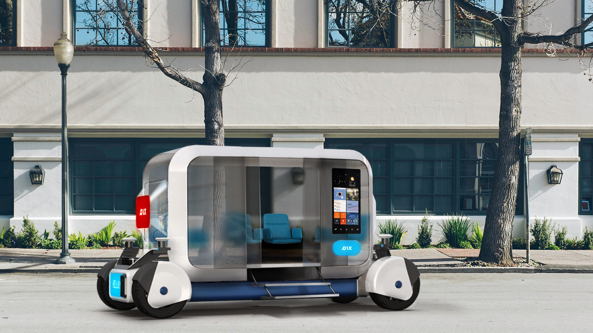
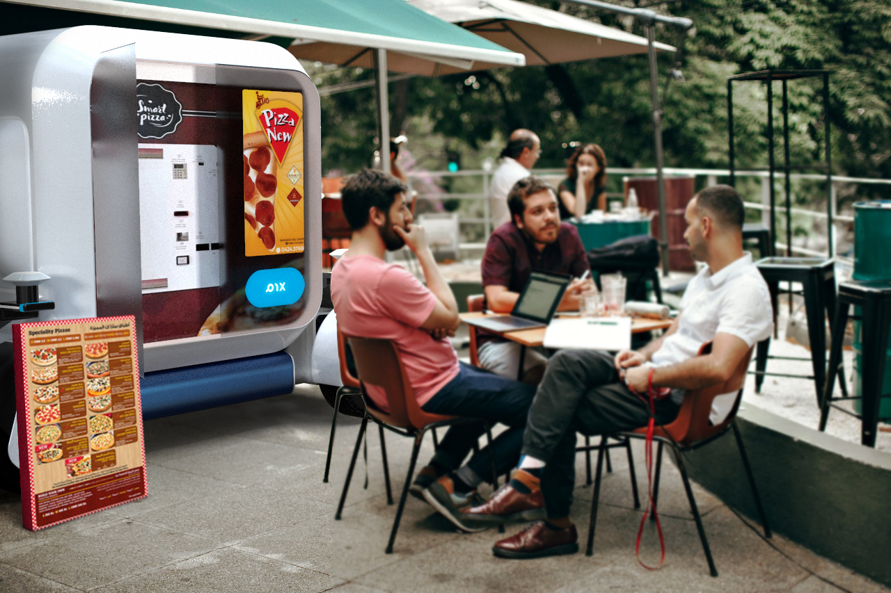
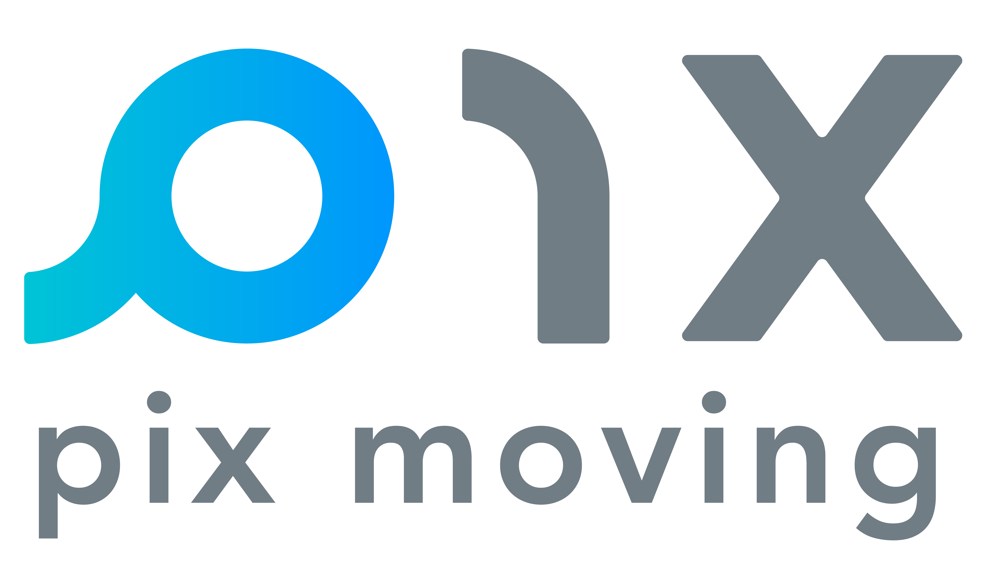

# PIXBOT
    

**PIXBOT**是世界上第一个开源自动驾驶底盘，目标是降低自动驾驶产品创新的门槛，并大幅度缩短产品上市时间，PIXBOT为产业界、学术界、开发者社区提供安全可靠、易于使用、高性能、低成本、可扩展的开源解决方案。PIXBOT采用软件定义的模块化设计，可访问的底层接口，开放的架构，硬件安全冗余，支持多种自动驾驶软件堆栈。。。 今天汽车无处不在。但是构建汽车的成本却几何级增长，只有极少的大型企业才能定制车辆，PIX正在改变这一切，为未来城市创新铺平道路。

PIXBOT基于开源协议GPL V3、知识共享协议CC BY-SA发布，欢迎您加入其中，并分享您的知识、代码、设计和想法，您可以自由使用代码和设计，根据您的需求进行调整，添加其他功能并与他人共享您的成就，以便更多人可以从您的成就中学习。同时，开源项目能够使您了解PIXBOT的运行方式，从而帮助您提升技能，您可以专注于自己的任务，而无需解决其他人已经解决的问题。 PIXBOT是最具创新性产品成功的关键，您的成功将成为这场运动的一部分。

PIXBOT不仅仅是开源解决方案，更是由全球爱好者和专家组成的协作社区，我们非常高兴每个创新者能基于PIXBOT构建自己的梦想，同时造福所有人。

# 主要模块

 - ## 转向系统

底盘为双转向机系统，可实现前后轮双转向模式，借助双转向能力可以实现多种转向功能，单方向机最大转向角为30°，系统可提供±1024级细分控制精度。

组成部件 | 配置数量 | 安装位置
--- | --- | --- 
转向方向机机械与电机总成 | 2 | 底盘前后置安装
电子转向控制器 | 2 | 底盘前后置安装

 - ## 制动系统

底盘提供高进度的伺服线控支持，最大液压达到10MP，同时可实现0-1024级的液压加压分辨率。支持长时间制动静态保持功能，同时支持10ms以内的高响应速度。

组成部件 | 配置数量 | 安装位置
--- | --- | --- 
液压总泵与伺服系统总成 | 1 | 底盘上腹位置安装
制动系统控制器 | 1 | 底盘上腹位置安装
四轮均分式液压油路 | 1 | 四轮位布置

 - ## 动力系统

动力系统采用四轮轮毂电机独立控制方式，为底盘提供4*4KW的强大动力，同时支持超低速自动泊车速度控制能力，具备0-1024级别细分速度控制，封锁后可提供最大60KM/H时速支持。

组成部件 | 配置数量 | 安装位置
--- | --- | --- 
轮毂电机 | 4 | 四轮位安装
制动系统控制器 | 4 | 底四轮位安装

 - ## 辅助功能

>电子驻车：底盘提供线控电子驻车功能

>灯光控制：底盘支持大灯，转向灯，尾灯，指示灯控制

>差速转向：通过分别控制四个轮毂电机来实现差速运动控制

详细生产资料和功能介绍请参见[WIKI](https://gitlab.com/pixmoving/pixbot/-/wikis/home)

# PIXBOT能做什么
 - ## 高校教学实验
 - ## 企业研究开发
 - ## 物流配送
 - ## 动力学性能测试
 
# 基于PIXBOT的产品
 - ## 观光车

 - ## 零售车
 
  - ## 移动空间
 

 # 关于我们
>[pix moving](https://www.pixmoving.com/)

