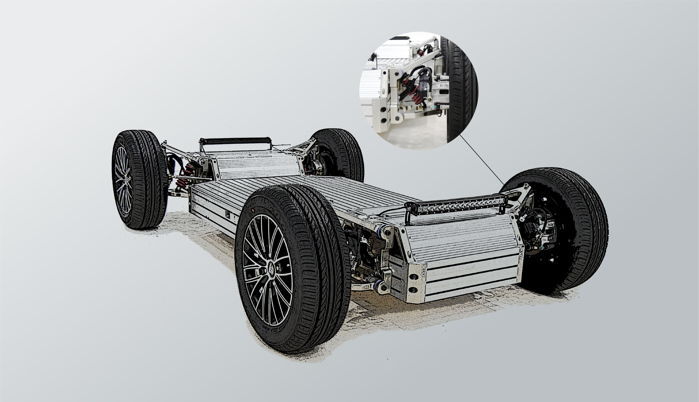
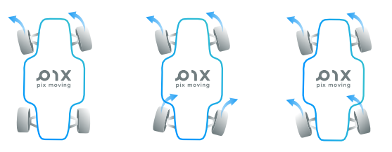
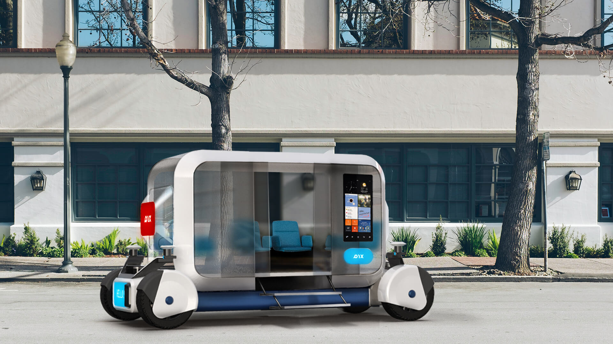
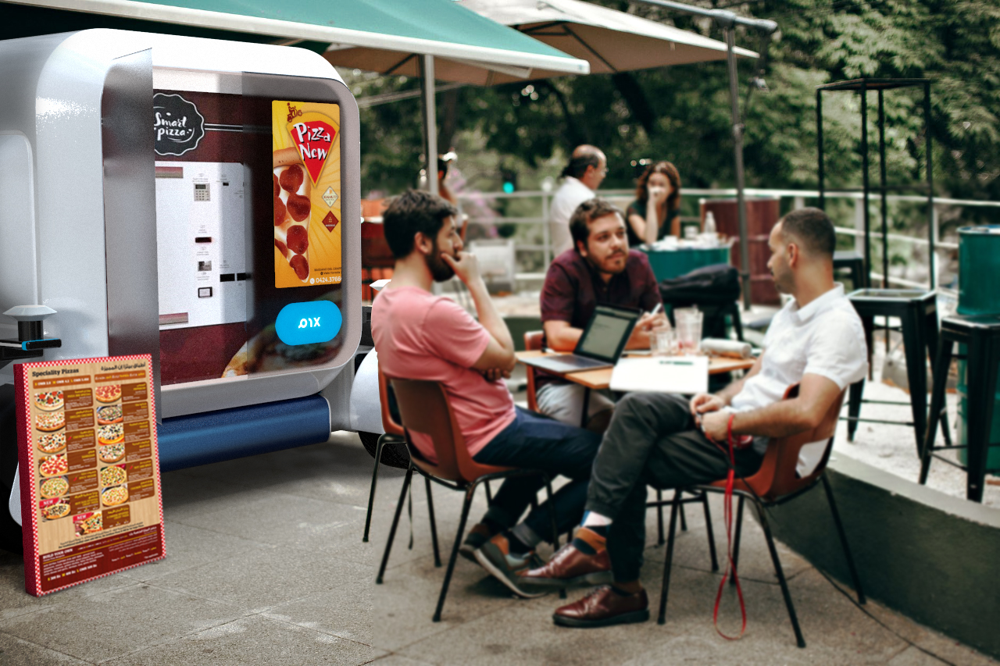
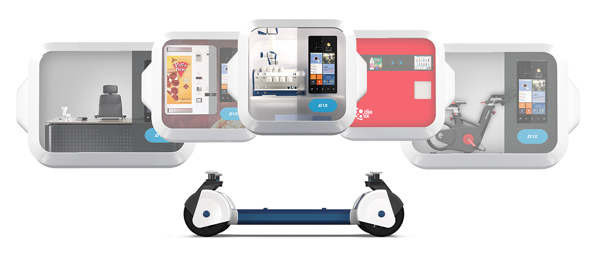
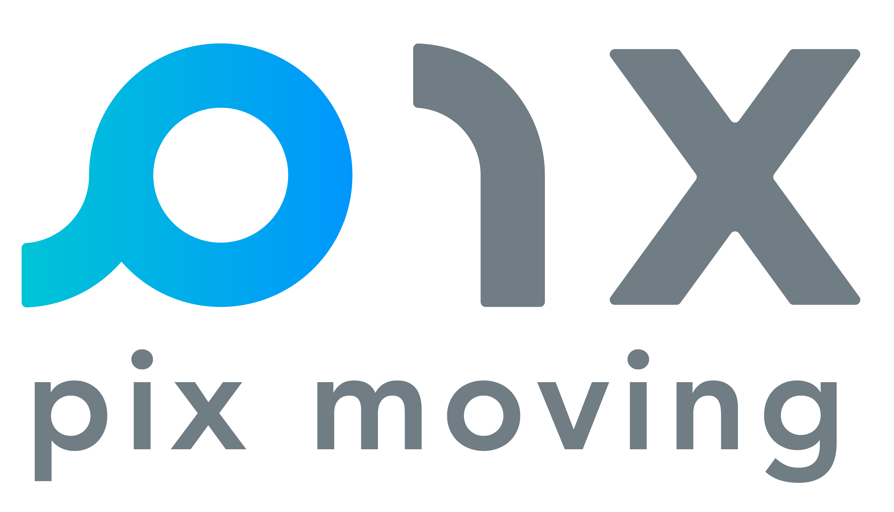

# PIXBOT
    

**PIXBOT** is the world’s first open source autonomous chassis, which is dedicated to lowering the innovation barrier of autonomous driving products and reducing the lead time of product development. 

As an open source solution for industries, academia and developer communities, PIXBOT is reliable, robust, easy-to-use, high-performance, affordable and extensible. PIXBOT applies software-defined modular design, provides accessible hardware interfaces, adopts open architecture, delivers hardware safety redundancy and supports a diverse range of autonomous driving software stack. Cars are ubiquitous nowadays, but the cost of building a car is growing exponentially. Only a few mogul enterprises are able to customize vehicles. PIX, is making a difference, paving the way for future city innovation.  
# Why does PIXBOT opensource

Cars are ubiquitous nowadays, but the cost of building a car is growing exponentially. Only a few mogul enterprises are able to customize vehicles. PIX, is making a difference, paving the way for future city innovation. 

PIXBOT enhances mutual growth and participants can educate themselves along the process. Moreover, open source project allows immersive understanding upon how PIXBOT works, helping build personal skills and expertise. Developers can remain concentrated on their tasks, saving the efforts to solve the problems that have been tackled down by others already.  PIXBOT greatly facilitates the process of creating a market-ready product and every success originated here marks the growth of the PIXBOT community itself. Your involvement is a part of this revolution.  

# How does PIXBOT opensource
PIXBOT is released based on the open source license GPL V3 and the creative commons license CC BY-SA. We’re inviting engineers, developers and visionaries to join in, share your knowledge, experiences, code, design and ideas. You’ll be equipped with the freedom to use the codes and designs, to tweak and tune based on your personal needs, add extension functions and to share with the community your achievements and “wow” moments. 

# Brief features and parameters of PIXBOT
 - ## Steering System

The chassis is a double-steering system, which can achieve the double-steering mode of front and rear wheels. Multiple steering functions can be realized with the aid of dual steering capability. The maximum steering angle of the single-directional machine is 30°, and the system can provide ±1024 level subdivision control accuracy.

Components | Allocation quantity | Installation location
-|-|-
Steering gear assembly | 2 | Front and rear install of the chassis
Electronic steering controller | 2 | Front and rear install of the chassis

 - ## Braking System

Chassis provides high-speed servo-by-wire support. The maximum hydraulic pressure is 10MP，at the same time, it can achieve 0-1024 level hydraulic pressure resolution. Supports long-time braking static holding function, while supporting high response speed within 10ms.

Components | Allocation quantity | Installation location
--- | --- | ---
Hydraulic master cylinder and servo system assembly | 1 | Installation on the upper part of the chassis
Brake system controller | 1 | Installation on the upper part of the chassis
Four-wheel uniform hydraulic oil circuit | 1 | Four-wheel arrangement

 - ## Power System

The power system adopts the independent control method of the four-wheel hub motor to provide a powerful 4 * 4KW power to the chassis while supporting ultra-low speed automatic parking speed control capabilities. With 0-1024 level subdivision speed control, it can provide a maximum of 60KM/H support after the blockade.

Components | Allocation quantity | Installation location
--- | --- | ---
Wheel hub motor | 4 | Four-wheel arrangement
Brake system controller | 4 | Bottom four-wheel mounting

 - ## Auxiliary Function

>Electronic parking: Chassis provides remote electronic parking function

>Light control: the chassis supports headlights, turn signals, tail lights, indicator lights control

>Differential steering: Differential motion control by controlling four hub motors separately

For detailed production data and function introduction, please refer to [WIKI](https://gitlab.com/pixmoving/pixbot/-/wikis/home)

# What you can do with PIXBOT
 - #### College teaching experiment
 - #### Enterprise research and development
 - #### Logistics
 - #### Dynamic perfomance test
 - #### Build pods of different functions on the PIXBOT platform

# Multi-functional pods based on PIXBOT
 - ## self-driving tour bus

 - ## retail car
 
  - ## moving space
 

 # About us
>[pix moving](https://www.pixmoving.com/)

